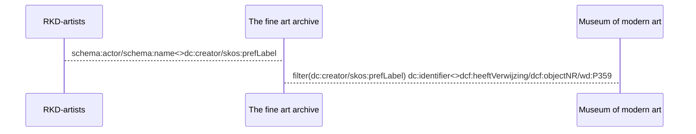
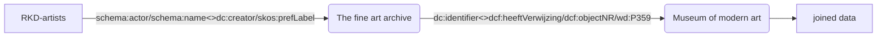

forked from: [martinwoodward/mermaid](https://gist.github.com/martinwoodward/8ad6296118c975510766d80310db71fd#file-mermaid-md)

```mermaid
sequenceDiagram
    participant RKD-artists
    participant The fine art archive
    participant Museum of modern art
    RKD-artists-->The fine art archive: schema:actor/schema:name<>dc:creator/skos:prefLabel
    The fine art archive-->Museum of modern art: filter(dc:creator/skos:prefLabel) dc:identifier<>dcf:heeftVerwijzing/dcf:objectNR/wd:P359
   
```

```mermaid
flowchart LR

A[RKD-artists] -->|schema:actor/schema:name<>dc:creator/skos:prefLabel| B(The fine art archive)
B -->|dc:identifier<>dcf:heeftVerwijzing/dcf:objectNR/wd:P359| C(Museum of modern art)
C --> D[joined data]

```

```mermaid
  graph TD;
      A-->B;
      A-->C;
      B-->D;
      C-->D;
```
